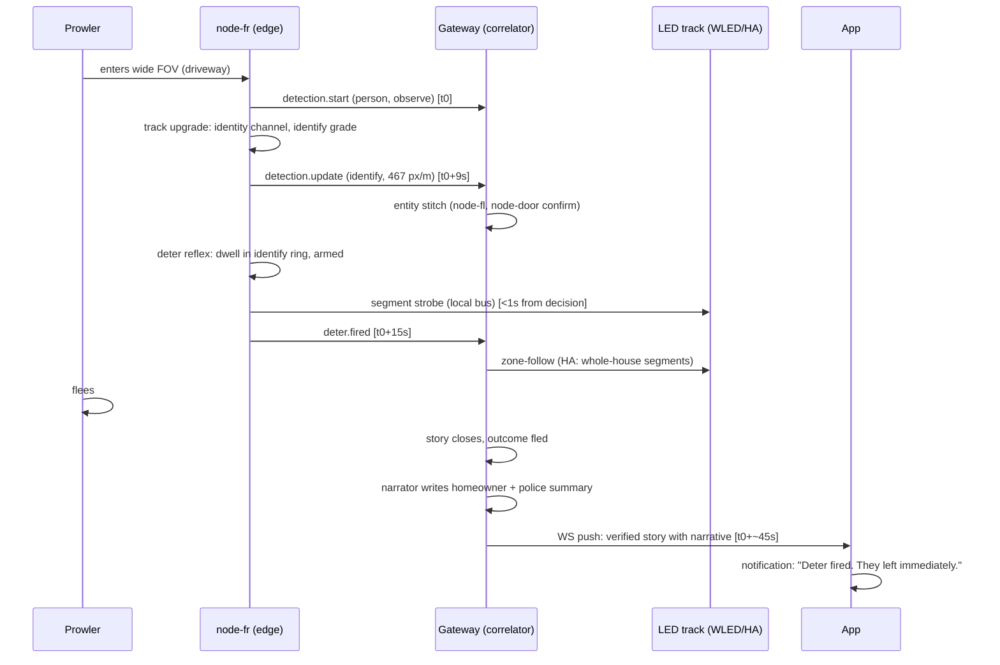

# System architecture

Four layers. Every interface named. The reflex lives at the edge, judgment at the gateway, memory where the plan allows, and agents around the outside.

## Layers

1. **Edge node** (track node, door node). Dual-sensor capture, on-node detection, 72 h loop storage, deter reflex, telemetry. Interfaces: `MQTT:events` (sightline.event.v1, QoS 1), `MQTT:telemetry` (sightline.telemetry.v1, QoS 0), `MQTT:deter-cmd` (subscribe), `MQTT:ota` (subscribe), `RTSP:streams` (wide + identity, gateway-only network), provisioning AP (first boot).
2. **Gateway correlator** (N100-class mini PC, Frigate + broker + correlator + HA). Cross-node re-ID, Event Story assembly, deter judgment, app API. Interfaces: `REST:api` (health, events, stories, quote, ask, scenes, deter), `WS:app` (story and event push), `MQTT:*` (broker host), `HA:automation` (deter to WLED segments), `ONVIF:passthrough` (NVR integrations).
3. **Optional cloud**. Plans, sync, monitoring hand-off. Interfaces: `HTTPS:sync` (Plus/Shield only, stories and flagged clips), `HTTPS:monitoring-webhook` (verified-event payload to central stations), `HTTPS:accounts`. On Core this layer does not exist for event data: there is no disabled sync path, there is no path.
4. **Agents**. Narrator, Ask, quote, support, dealer GTM. All run against gateway data through the same REST the app uses. Claude modes are optional; mock modes are deterministic and always available.

## The 2:14 AM flow

## Latency budgets

| Hop | Budget | Notes |
|---|---|---|
| Detection to deter reflex (edge, local) | < 1 s | node decides and fires its own segments; never waits on the gateway |
| Deter to whole-house zone-follow (HA path) | < 2 s | broker + HA automation + WLED JSON |
| detection.start to app live tile | < 3 s | MQTT + correlator + WS |
| Story close to narrated notification | < 15 s | narrator mock is instant; Claude mode budgeted |
| End to end, scripted 2:14 scenario | < 60 s | measured ~35 to 40 s in the demo |

## Interface contracts

Wire schemas are the law: `gateway/schemas/*.schema.json`, versioned, validated at publish and ingest on both sides. Anything that does not validate is rejected and counted, never coerced.

## Failure behavior

- Gateway down: nodes keep recording to loop, keep the deter reflex, queue events (bounded) for redelivery.
- Wi-Fi down: bus data pair carries control (see network.md); loop recording continues.
- Cloud down or absent (Core): everything above still works. Cloud is a convenience layer, not a dependency.
